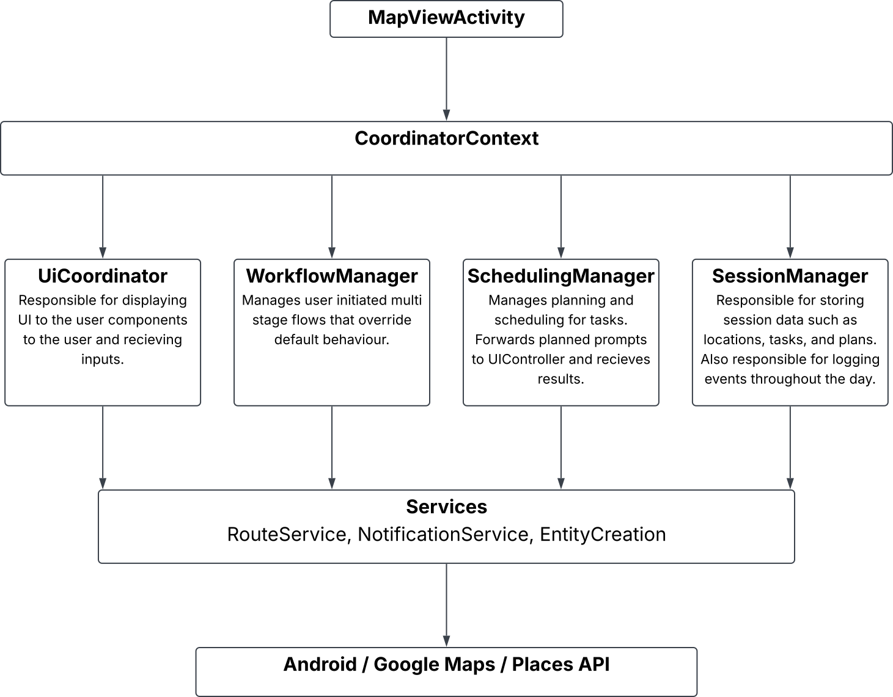

# Architecture Overview

This application is organised into four primary layers that separate presentation, orchestration, business logic and external integrations.

## Project Goals

* Modular architecture
* Separation of UI and business logic
* Reusable components
* Easy extension through workflows
* Testable scheduling engine

---

## High-Level Architecture

Figure 1. High-level architecture of the application.

As shown in Figure 1, the `MapViewActivity` is responsible for
initialising controllers, coordinators and services before delegating responsibility to specialised components.

Business logic is primarily handled by coordinator classes such as SchedulingManager, SessionManager and WorkflowManager, while external integrations are provided through service implementations.

## Package Structure

activities/ Screens, fragments, controllers and user interactions

coordinators/ Application orchestration and business logic

core/ Shared models, interfaces, repositories and reusable UI components

services/ External integrations and infrastructure services

This structure was chosen to ensure that user interface components remain isolated from scheduling logic and external service implementations.

---

## Architectural Layers

### Presentation Layer
The Presentation Layer contains all user-facing screens and visual components.

**Responsibilities:** Rendering UI, Recieving Input, Presenting Timelines & Schedules, and Managing Interactions.

**Primary Components:**
* MapViewActivity
* PlannerViewActivity
* Fragments
* Controllers
* Custom Views (TimelineView, PlannerStateView)
---

### Application Layer
The Application Layer coordinates communication between subsystems.

**Responsibilities:** Session management, Workflow execution, Planner evaluation, Navigation coordination, UI state management.

**Primary Components:**
* MapViewCoordinator
* SchedulingManager
* SessionManager
* WorkflowManager
---

### Service Layer
The Service Layer provides access to external functionality.

**Responsibilities:** Route estimation, Notification delivery, Entity creation, Platform integrations

**Primary Components:**
* GoogleRouteService
* PlannerNotificationManager
* DefaultEntityCreationService
---

### Data Layer
The Data Layer stores and exposes application data.

**Responsibilities:** Persistence, Repository access, Domain models, ViewModel integration

**Primary Components:**
* SessionManager
* TaskItem
* PlannedTask
* LocationItem
* DailySession