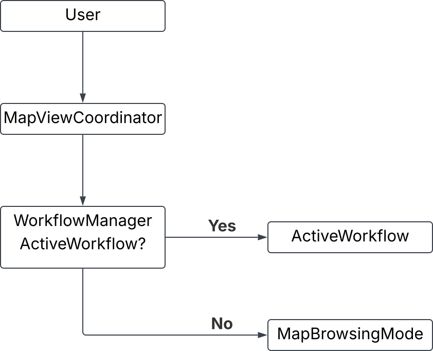
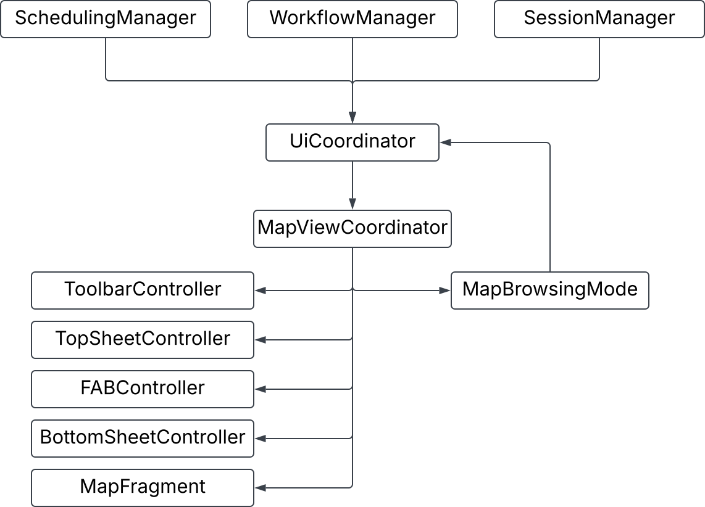

# MapViewCoordinator

## Overview
The `MapViewCoordinator` acts as the central controller within the `MapViewActivity`. It coordinates communication between UI components, workflow objects, and the other Coordinator classes. Its Primary Responsibility is to translate user interactions into application actions. It is also reponsible for keeping these UI components synchronised with the applications current state.

This class follows a Coordinator pattern, allowing Activities and Fragments to remain lightweight while centralising navigation and interaction logic.
## Responsibilities
* Recieving events from UI Controllers
* Routing events to the active workflow if exist
* Routing events to `MapBrowsingMode` if active workflow doesn't exist
* Observing session data
* Updating the map when application data changes
* Managing top and bottom sheets
* Managing planner prompts
* Acting as the implementationof the `UiCoordinator` interface for the MapViewActivity

## Controllers
| Component             | Responsibility                      |
| --------------------- | ----------------------------------- |
| MapToolbarController  | Toolbar events                      |
| MapFabController      | Floating action button              |
| TopSheetController    | Top sheet presentation              |
| BottomSheetController | Bottom sheet presentation           |
| MapFragment           | Map rendering                       |

## Event Routing
User interaction follows a common routing model throughout the coordinator.

Whenever a UI event occurs, the coordinator first checks whether an active workflow is currently running.
* If a workflow is active, the event is delegated to the workflow.
* Otherwise, the event is handled by the default MapBrowsingMode.

## UI Coordination
Rather than allowing managers to manipulate UI elements directly, the application exposes the UiCoordinator interface. This interface is implemented by the MapViewCoordinator, allowing other parts of the application to request UI changes.

This approach provides two important advantages.

* Business logic remains independent of Android UI classes such as Fragments and Activities.
All UI state transitions occur within a single coordinator, reducing coupling between subsystems and preventing conflicting UI updates.

* The coordinator acts as the communication hub between the application's managers and the presentation layer.

Figure 1: Dependency chart for the MapViewCoordinator class and the UiCoordinator interface

As shown above all 3 of the other coordinators access the MapViewCoordinator through the UiCoordinator interface.

| Component         | Typical Requests                             |
| ----------------- | -------------------------------------------- |
| WorkflowManager   | Show forms, disable map gestures, update FAB |
| SchedulingManager | Display planner prompts, update countdown    |
| SessionManager    | No direct UI updates (provides data only)    |

The, MapBrowsingMode is also able to call UiCoordinator functions. This allows the default interaction flow to include default sheets Like the `DayPlanFragment` and the `LocationPlanFragment`.
